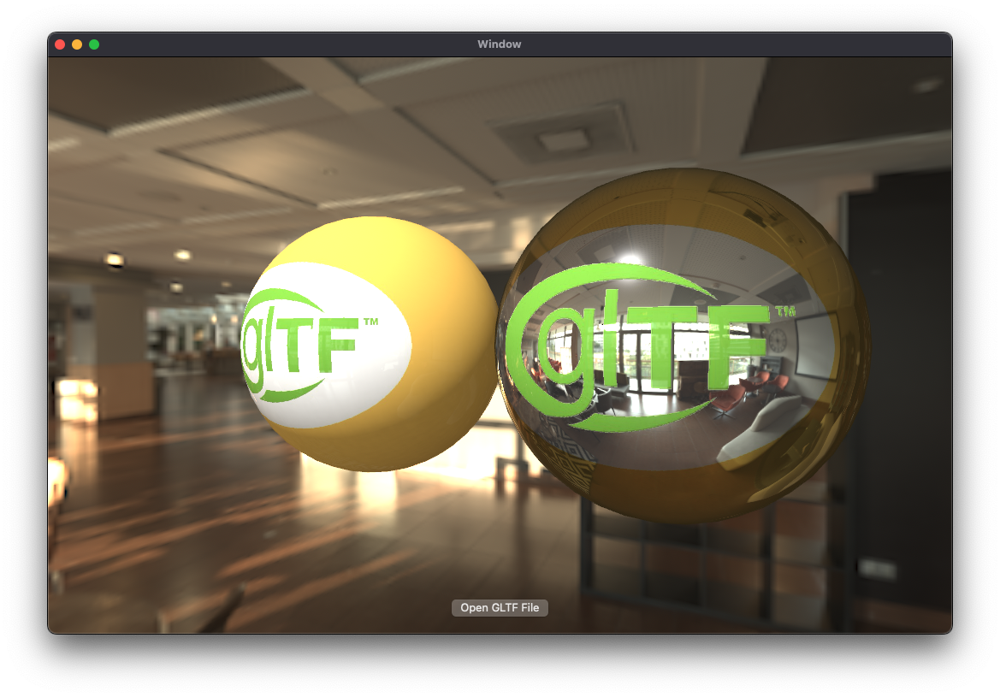
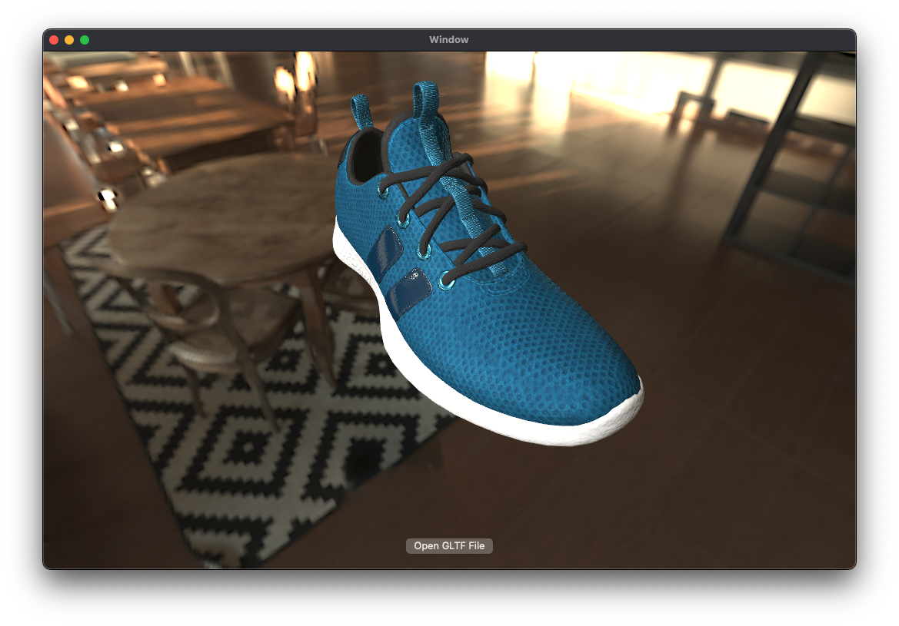
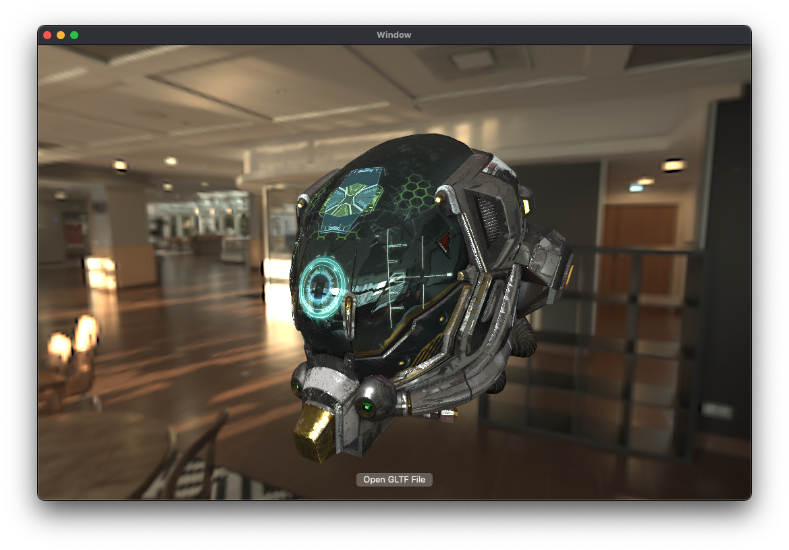

# SwiftGLTF
glTFおよびGLBファイルをSwiftで利用できるようにするプロジェクト





## Features
- glTFおよびGLBファイルをデコードし、 `MDLAsset` としてSwiftで扱えるようにする
- MetalによるglTFファイルの高速レンダリング

### 将来的な機能
- glTFのアニメーションをサポート
- glTFの拡張機能をサポート
- カスタマイズ可能なレンダリングパイプライン
- 3Dモデルの編集およびエクスポート機能
- VRMフォーマットのサポート
など

## Usage
### Platform
- iOS 15.0+
- macOS 13.0+

### Install
#### Swift Package Manager
```swift
dependencies: [
    .package(url: "https://github.com/nhiroyasu/SwiftGLTF.git", branch: "main")
]
```

### Sample Code
#### UIKit
```swift
import SwiftGLTF

let gltfUrl = // URL to your glTF or GLB file
let gltfView = GLTFView(frame: view.frame, url: gltfUrl)
view.addSubview(gltfView)
```

#### SwiftUI
```swift
import SwiftGLTF

var body: some View {
    @State private var gltfUrl = // URL to your glTF or GLB file
    GLTFMetalView(url: gltfUrl)
}
```

## Supported glTF features
- 非対応の機能は今後のアップデートでサポート予定です

### File formats
| Format              | Supported |
|---------------------|-----------|
| glTF Binary (.glb)  | ✅         |
| glTF JSON (.gltf)   | ✅         |

### Buffer formats
| Format                              | Supported |
|-------------------------------------|-----------|
| External .bin file                  | ✅         |
| Embedded (data URI in .gltf)        | ✅         |

### Image formats
| Format     | Supported |
|------------|-----------|
| PNG        | ✅         |
| JPEG       | ✅         |
| KTX2       | ❌         |

### Mesh Compression
| Extension                        | Supported |
|----------------------------------|-----------|
| KHR_draco_mesh_compression       | ❌         |

### PBR Materials (metallic-roughness)
| Property                    | Supported |
|-----------------------------|-----------|
| baseColorFactor             | ✅         |
| baseColorTexture            | ✅         |
| metallicFactor              | ✅         |
| roughnessFactor             | ✅         |
| metallicRoughnessTexture    | ✅         |

### Additional Material Properties
| Property             | Supported |
|----------------------|-----------|
| normalTexture        | ✅         |
| occlusionTexture     | ✅         |
| emissiveTexture      | ✅         |
| emissiveFactor       | ✅         |
| alphaMode            | ✅         |
| alphaCutoff          | ✅         |
| doubleSided          | ❌         |

### Vertex Attributes
| Attribute     | Supported |
|---------------|-----------|
| POSITION      | ✅         |
| NORMAL        | ✅         |
| TANGENT       | ✅         |
| TEXCOORD_0    | ✅         |
| TEXCOORD_1    | ✅         |
| COLOR_0       | ✅         |
| JOINTS_0      | ❌         |
| WEIGHTS_0     | ❌         |

### Node Hierarchy and Transforms
| Feature                                 | Supported |
|-----------------------------------------|-----------|
| Node hierarchy                          | ✅         |
| matrix (4x4 transform matrix)           | ✅         |
| translation / rotation / scale (TRS)    | ✅         |

### Animation
| Channel                  | Supported |
|--------------------------|-----------|
| translation              | ❌         |
| rotation                 | ❌         |
| scale                    | ❌         |
| morph target weights     | ❌         |

### Scenes
| Feature                 | Supported |
|-------------------------|-----------|
| Multiple scenes         | ❌         |

### Cameras
| Feature                 | Supported |
|-------------------------|-----------|
| Camera                  | ❌         |

## Build
### Sample Project
- SwiftGLTFSample.xcodeproj を開くことでサンプルプロジェクトをビルドできます

### Project Structure
#### SwiftGLTFRenderer
- glTFファイルをMetalでレンダリングするためのライブラリ

#### SwiftGLTFParser
- glTFを解析し、 `MDLAsset` としてSwiftで扱えるようにするライブラリ

#### SwiftGLTF
- glTFファイルをViewに表示する機能を提供するライブラリ（UIKitの`GLTFView`およびSwiftUIの`GLTFMetalView`を含む）

#### SwiftGLTFCore
- glTFの基本的なデータ構造を定義するライブラリ

#### MikkTSpace
- glTFの法線計算を行う
- [mmikk/MikkTSpace](https://github.com/mmikk/MikkTSpace) からの流用
