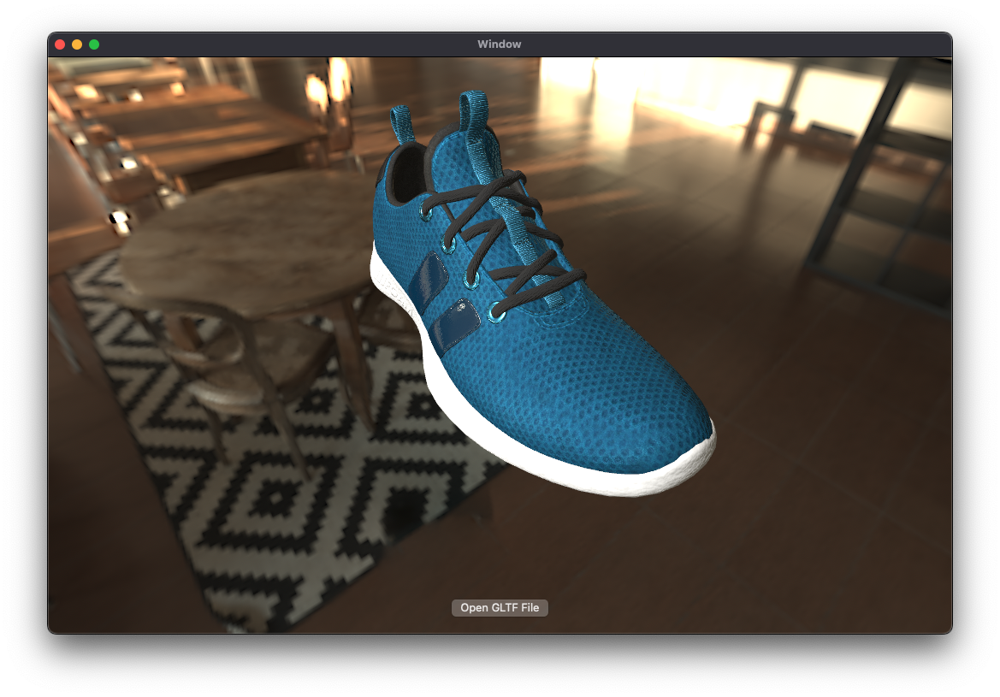

# SwiftGLTF

A project that enables using glTF files in Swift.

  
  
  

## Features
- Decodes glTF and GLB files and makes them available as `MDLAsset` in Swift
- High-performance glTF rendering with Metal

### Planned Features
- glTF animation support  
- glTF extension support  
- Customizable rendering pipeline  
- 3D model editing and exporting features  
- VRM format support  
And more.

## Usage
### Platform
- iOS 15.0+
- macOS 13.0+

### Installation
#### Swift Package Manager
```swift
dependencies: [
    .package(url: "https://github.com/nhiroyasu/SwiftGLTF.git", branch: "main")
]
```

### Sample Code
```swift
import MetalKit
import SwiftGLTF
import SwiftGLTFRenderer

// ...

let gltfUrl = // URL to your glTF or GLB file
let data = try Data(contentsOf: gltfUrl)
let gltf = try loadGLTF(from: data)
let asset = try makeMDLAsset(
    from: gltf,
    baseURL: url.deletingLastPathComponent(),
    options: options
)

let mtlView = try await MDLAssetPBRMTKView(
    frame: view.frame,
    device: MTLCreateSystemDefaultDevice()!,
    commandQueue: device.makeCommandQueue()!,
    asset: asset
)
view.addSubview(mtlView)
```

## Supported glTF Features
- Unsupported features are planned to be added in future updates.

### File Formats
| Format              | Supported |
|---------------------|-----------|
| glTF Binary (.glb)  | ✅         |
| glTF JSON (.gltf)   | ✅         |

### Buffer Formats
| Format                              | Supported |
|-------------------------------------|-----------|
| External .bin file                  | ✅         |
| Embedded (data URI in .gltf)        | ✅         |

### Image Formats
| Format     | Supported |
|------------|-----------|
| PNG        | ✅         |
| JPEG       | ✅         |
| KTX2       | ❌         |

### Mesh Compression
| Extension                        | Supported |
|----------------------------------|-----------|
| KHR_draco_mesh_compression       | ❌         |

### PBR Materials (metallic-roughness)
| Property                    | Supported |
|-----------------------------|-----------|
| baseColorFactor             | ✅         |
| baseColorTexture            | ✅         |
| metallicFactor              | ✅         |
| roughnessFactor             | ✅         |
| metallicRoughnessTexture    | ✅         |

### Additional Material Properties
| Property             | Supported |
|----------------------|-----------|
| normalTexture        | ✅         |
| occlusionTexture     | ✅         |
| emissiveTexture      | ✅         |
| emissiveFactor       | ✅         |

### Vertex Attributes
| Attribute     | Supported |
|---------------|-----------|
| POSITION      | ✅         |
| NORMAL        | ✅         |
| TANGENT       | ✅         |
| TEXCOORD_0    | ✅         |
| TEXCOORD_1    | ❌         |
| COLOR_0       | ✅         |
| JOINTS_0      | ❌         |
| WEIGHTS_0     | ❌         |

### Node Hierarchy and Transforms
| Feature                                 | Supported |
|-----------------------------------------|-----------|
| Node hierarchy                          | ✅         |
| matrix (4x4 transform matrix)           | ✅         |
| translation / rotation / scale (TRS)    | ✅         |

### Animation
| Channel                  | Supported |
|--------------------------|-----------|
| translation              | ❌         |
| rotation                 | ❌         |
| scale                    | ❌         |
| morph target weights     | ❌         |

## Build
### Sample Project
- You can build the sample project by opening `SwiftGLTFSample.xcodeproj`.

### Project Structure
#### SwiftGLTFRenderer
- A library for rendering glTF files using Metal.

#### SwiftGLTF
- A library that parses glTF and converts it into `MDLAsset` for use in Swift.

#### SwiftGLTFCore
- A library that defines the core data structures of glTF.

#### MikkTSpace
- Performs normal vector computation for glTF  
- Based on [mmikk/MikkTSpace](https://github.com/mmikk/MikkTSpace)
